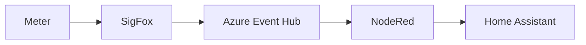
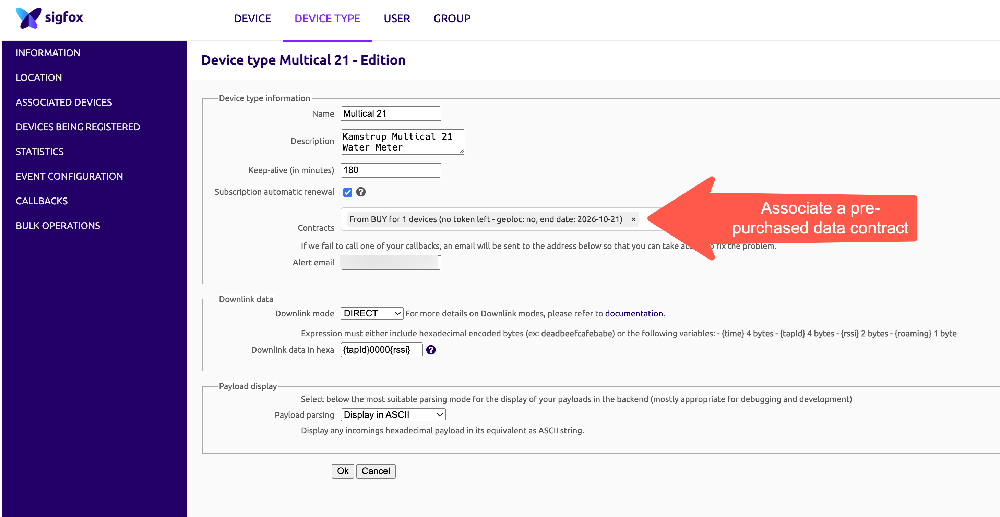
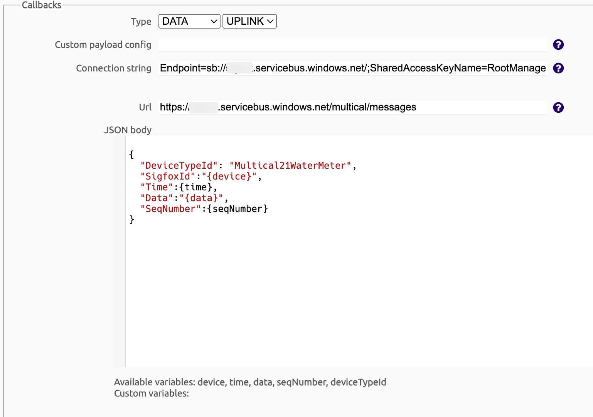
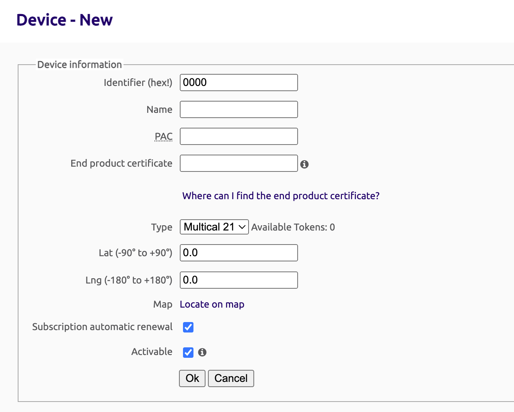

# Read Kamstrup Water Meter into Home Assistant

The repo contains instructions on how to integrate a Sigfox-based Kamstrup water meter with Home Assistant using Node-Red and Azure event hub.

## Requirements

I tried to integrate with the Ontec API but the documentation was limited and topics such as authentication were vague.  Instead I elected to integrate directly.  This comes with some additional costs and more complex steps.

In short you will need:

* A Sigfox account and communications plan.  I bought mine online from Skwidnet in South Africa after having registered with the Sigfox portal.

* You KEM file from Kamstrup.  This file contains descriptiors of the meter, it's serial number and, most importantly, the decryption (**DEK**) key.

* There's a great [Python script](https://gist.github.com/jschlyter/87a545d41a073b5682e4f2e99277aa76) to extract your *DEK* from the *KEM* file.  

## Sigfox Configuration

Log in to the [Sigfox Backend](https://backend.sigfox.com/auth/login)
Create a new "Device Type" 

One the "Callbacks" page, you need to add a callback as a destination to send payloads received from the meter.  I had two.  One, an e-mail address, for testing and another was a callback to my Azure Event Hub.

SigFox supports Azure Event Hubs as a native callback integration.   Creating an Event Hub and locating the connection string is outside the scope of this article.

This is how I set mine up

Then create a new Device and associate it with the device type.  

the **PAC** field was critical here as my meter was transferred to me by the existing owner (Ontec). I logged a support call with them and they sent me the HEX identifier of rthe meter and the PAC code (whcih is an authorisations code to transfer a device between SigFox accounts)

Once this config is complete, you should have your meter sending regular (hourly) messages to SigFox and then SigFox calling your Event Hub with the message in the custom payload format speficied in your callback config.

Now we need to read that payload off Event Hub.  Decode it and update Home Assistant.

